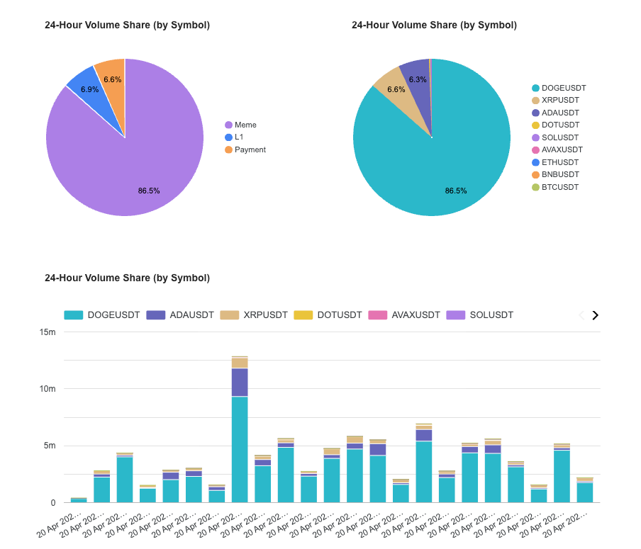

# Binance Real-Time Data Engineering Project

## 📈 Project Overview
This project is a comprehensive data engineering pipeline designed to ingest, process, and analyze real-time cryptocurrency market data from Binance. It demonstrates a modern streaming architecture that transitions from live WebSocket streams to structured analytical models in the cloud.

The pipeline captures K-line (candlestick) data for 10 major trading pairs, processes them through a streaming engine, and stores them in a data lake before orchestrating transformation and loading into a data warehouse for business intelligence.

---

## 🛠 Technologies Used

- **Infrastructure as Code (IaC):** [Terraform](https://www.terraform.io/) to provision Google Cloud Platform (GCP) resources.
- **Cloud Provider:** [Google Cloud Platform](https://cloud.google.com/)
    - **Google Cloud Storage (GCS):** Data Lake for storing raw Parquet files.
    - **BigQuery:** Data Warehouse for structured data analysis.
- **Message Broker:** [Redpanda](https://redpanda.com/) (Kafka-compatible) for high-throughput streaming.
- **Stream Processing:** [Apache Flink](https://flink.apache.org/) for consuming Kafka topics and sinking data to GCS as partitioned Parquet files.
- **Orchestration:** [Kestra](https://kestra.io/) for managing workflows, loading data from GCS to BigQuery, and triggering dbt builds.
- **Data Transformation:** [dbt (data build tool)](https://www.getdbt.com/) for modeling raw data into analytical marts.
- **Language:** [Python](https://www.python.org/) for the data producer (streaming Binance data) and Flink jobs.
- **Package Management:** [uv](https://github.com/astral-sh/uv) for fast and reliable Python dependency management.

---

## 💼 Business Problem
In the fast-paced world of cryptocurrency trading, real-time insights are crucial. However, raw WebSocket data is ephemeral and difficult to analyze at scale. This project solves the following challenges:

1.  **Persistence of Streaming Data:** Capturing transient WebSocket messages from Binance and storing them in a durable, queryable format.
2.  **Scalable Data Ingestion:** Handling high-frequency updates from multiple symbols simultaneously without data loss.
3.  **Real-time to Batch Transition:** Bridging the gap between streaming ingestion and historical batch analysis.
4.  **Market Monitoring:** Providing automated insights into market trends, such as symbol dominance based on trading volume.

---

## 📊 Market Dominance Analysis
One of the key analytical outputs of this project is the **Market Dominance** report. 

### Analytical Insights
The project transforms raw trading data into meaningful business metrics:

- **24-Hour Volume Share (by Symbol):** / **24-Hour Volume Share (by Category):** A high percentage for a specific symbol or category indicates high volatility or strong investor interest, while a balanced distribution suggests a more stable or diversified market state.
- **Trading Volume Over Time (5min):** A stacked bar chart that shows the total volume across all symbols on 5 min basis. Each bar is divided by symbol, providing a visual representation of how market activity fluctuates throughout the day and which coins contribute most to those peaks.



---

## 🚀 Steps to Run the Project

### 1. Infrastructure Setup
Provision the GCP resources using Terraform:
1.  Follow the installation instructions [here](https://github.com/DataTalksClub/data-engineering-zoomcamp/blob/main/01-docker-terraform/terraform/README.md).
2.  Update [terraform/variables.tf](terraform/variables.tf) with your project details.
3.  Run:
```bash
cd terraform
terraform init
terraform apply 
cd ../
```

### 2. Services Deployment
Launch the core services (Redpanda, Kestra, Flink) using Docker:
1.  Configure your environment variables in [docker/.env](docker/.env).
2.  Start the containers:
```bash
cd docker
docker compose up --build -d 
cd ../
```
*(Note: The Flink image was tested on Apple M4 architecture; compatibility may vary on other systems.)*

3.  Verify the services are running:

| Link                  | Description                                       |
| -----------           |---------------------------------------------------|
| http://localhost:8080 | Redpanda Console (view topics and messages)       |
| http://localhost:8081 | Flink UI (monitor jobs and tasks)                 |
| http://localhost:8082 | Kestra UI (Login: `admin@admin.com` / `Qwerty123!`) |

### 3. Data Streaming (Producer)
Start the Python producer to stream data from Binance to Kafka:
1.  Install `uv` if needed:
```bash
pip install uv 
```
2.  Run the producer script:
```bash
cd streaming-producer
uv sync 
uv run python producer.py 
```

### 4. Stream Processing (Consumer)
Submit the Apache Flink job to consume Kafka messages and save them to GCS:
1.  Run the following command in a new terminal:
```bash
cd docker
docker compose exec jobmanager ./bin/flink run \
    -py /opt/src/consumer2.py \
    --pyFiles /opt/src -d
```
2.  Monitor the Flink UI to see the job running.
3.  Check your GCS bucket for new directories and Parquet files (created according to checkpoint and partition intervals).


### 5. Orchestration & Warehouse (Kestra & dbt)
Finalize the pipeline in the Kestra UI (http://localhost:8082). 
The data from GCS is loaded into BigQuery via Kestra flows. Copy the following flow definitions into Kestra:

- **[create_raw_tables.yaml](kestra/create_raw_tables.yaml):** Run manually to create the initial BigQuery tables.
- **[gcs_to_bigquery_trigger.yaml](kestra/gcs_to_bigquery_trigger.yaml):** Automatically triggers when a new partition is committed in GCS to load data into BigQuery.
- **[dbt_build.yaml](kestra/dbt_build.yaml):** Scheduled to run `dbt build` (default: hourly) to transform raw data into analytical models.

**Before running the dbt workflow:**
1.  Update the connection details in [dbt/profiles.yml](dbt/profiles.yml).
2.  Restart the Kestra service to apply changes:
```bash
cd docker
docker compose up -d kestra     
cd ../
```